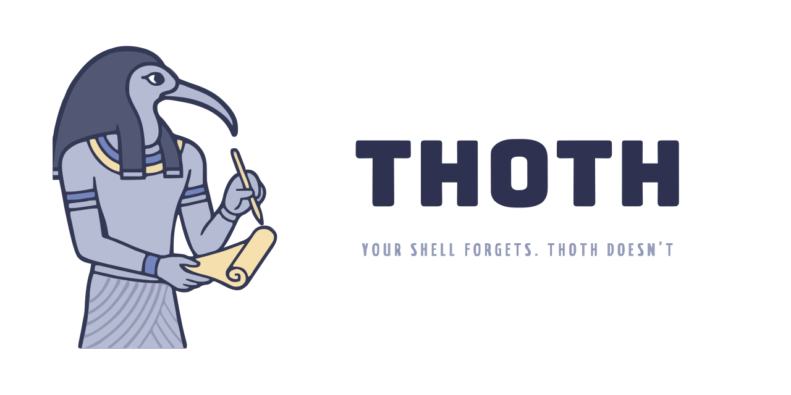
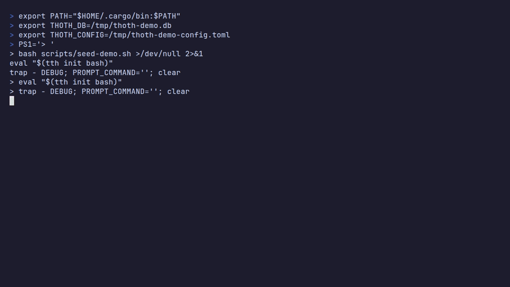

<p align="center">
  <picture>
    <source media="(prefers-color-scheme: dark)" srcset="assets/thoth_dark.svg">
    
  </picture>
</p>

<p align="center">
  An intelligent shell history that captures every command with its context and makes it searchable.
</p>

<p align="center">
  <a href="https://github.com/JoseVelazcoH/Thoth/releases"></a>
  <a href="LICENSE"></a>
  
</p>

> [Thoth](https://en.wikipedia.org/wiki/Thoth), the moon god of ancient Egypt and god of
> wisdom, was the scribe and counselor of the sun god Ra. Just as Thoth recorded the memory
> of the universe, this tool inherits his name to become the keeper of your workflow, making
> sure no valuable command is lost to the oblivion of the shell.

Inspired by [Atuin](https://github.com/atuinsh/atuin) (highly recommended). Thoth shares the
goal of a smarter shell history and focuses on turning it into something you can act on:
record-and-replay **workspaces**, a themeable vim-style TUI, and a finder-style search.

<p align="center">
  
</p>

## Features

- **Context capture** - every command is saved with its directory, project, exit code,
  duration, and active tags.
- **Finder-style search** - an interactive TUI (press `Ctrl-R`) with live multi-field fuzzy
  matching, a preview pane, and a `:` cmdline for precise filters
  (`project:`, `tag:`, `exit:ok|fail`, `since:`, `until:`, `dur:>30`).
- **Workspaces** - record a window of commands (`tth-sw <name>` / `tth-ew`) and replay the
  whole sequence in order, in your shell.
- **Vim-style modal TUI** - `Esc` for normal mode, `j/k` to move, `d` to delete, `e` to
  edit, `?` for help.
- **Themeable** - 11 built-in themes (Catppuccin flavors, Dracula, Tokyo Night, Rosé Pine,
  Solarized, and more) plus your own, with quick switching via `tth theme <name>`.
- **Sessions, stats, export, and tags** for organizing and reusing your history.
- **Private by default** - Thoth's own commands and anything matching your history filter
  are never recorded, and everything lives in a local SQLite database.

See [docs/features.md](docs/features.md) for a deeper guide to every feature.

## Install

### Prebuilt binary (recommended)

```sh
curl --proto '=https' --tlsv1.2 -LsSf \
  https://github.com/JoseVelazcoH/Thoth/releases/latest/download/thoth-installer.sh | sh
```

### With Cargo

```sh
cargo install --path .   # from a clone; requires a Rust toolchain
```

### From source

```sh
git clone https://github.com/JoseVelazcoH/Thoth.git
cd Thoth
cargo install --path .
```

### Enable the shell integration

```sh
tth install     # adds the eval line to your shell rc (bash or zsh)
exec $SHELL     # reload your shell, or open a new terminal
```

## Quick start

- Press **`Ctrl-R`** to open the interactive search.
- **Type** to fuzzy-filter across the command, project, directory, and tags.
- Press **`Esc`** for normal mode, then **`:`** to open the filter cmdline
  (e.g. `project:thoth exit:fail`), or **`?`** for help.
- **`Enter`** runs the selected command, **`Tab`** puts it on your prompt to edit.

Record a workspace and replay it later:

```sh
tth-sw deploy        # start recording into the "deploy" workspace
# ... run your commands ...
tth-ew               # stop
```

Then open the TUI, switch to the **Workspaces** tab (`→`), and press `Enter` to replay it.

## Contributing

Contributions are welcome! See [CONTRIBUTING.md](CONTRIBUTING.md) to get started, and please
follow our [Code of Conduct](CODE_OF_CONDUCT.md).

## License

Released under the [MIT License](LICENSE).
